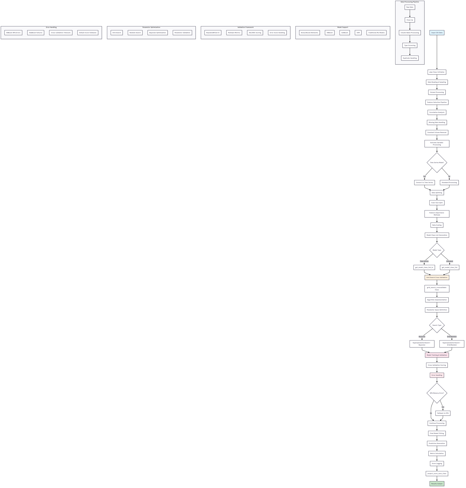

# ml_binary_classification_gridsearch_hyperOpt

[](https://samorahunter.github.io/ml_binary_classification_gridsearch_hyperOpt/)

[](https://github.com/SamoraHunter/ml_binary_classification_gridsearch_hyperOpt/actions/workflows/notebook-test.yml)
[](https://opensource.org/licenses/MIT)

This repository contains Python code for binary classification using grid search and hyperparameter optimization techniques.

# Table of Contents

- [ml_binary_classification_gridsearch_hyperOpt](#ml_binary_classification_gridsearch_hyperopt)
- [Overview](#overview)
- [Diagrams](#diagrams)
- [Features](#features)
- [Getting Started](#getting-started)
  - [Prerequisites](#prerequisites)
- [Installation](#installation)
  - [Windows](#windows)
  - [Unix/Linux](#unixlinux)
- [Usage](#usage)
- [Examples](#examples)
- [Project Structure](#project-structure)
- [Contributing](#contributing)
- [License](#license)
- [Appendix](#appendix)
- [Acknowledgments](#acknowledgments)


## Overview

Binary classification is a common machine learning task where the goal is to categorize data into one of two classes. This repository provides a framework for performing binary classification using various machine learning algorithms and optimizing their hyperparameters through grid search and hyperparameter optimization techniques.

## Features

This framework is designed to be a comprehensive toolkit for binary classification experiments, offering a wide range of configurable options:

- **Diverse Model Support:** Includes a collection of standard classifiers (e.g., Logistic Regression, SVM, RandomForest, XGBoost, LightGBM, CatBoost, H2O AutoML/GLM/GBM) and specialized time-series models from the `aeon` library (e.g., HIVE-COTE v2, MUSE, OrdinalTDE).
- **Advanced Hyperparameter Tuning:** Supports multiple search strategies:
  - **Grid Search:** Exhaustively search a defined parameter grid.
  - **Random Search:** Randomly sample from the parameter space.
  - **Bayesian Optimization:** Intelligently search the parameter space using `scikit-optimize`.
- **Configurable Data Pipeline:** A highly modular pipeline allows for fine-grained control over data processing steps:
  - **Feature Selection:** Toggle groups of features (e.g., demographics, blood tests, annotations).
  - **Data Cleaning:** Handle missing values, constant columns, and correlated features.
  - **Resampling:** Address class imbalance with oversampling (RandomOverSampler) or undersampling (RandomUnderSampler).
  - **Scaling:** Apply standard scaling to numeric features.
- **Automated Results Analysis:** Includes tools to automatically aggregate results from multiple runs and generate insightful plots, such as global parameter importance.
- **Time-Series Capabilities:** Specialized pipeline mode for handling time-series data, including conversion to the required 3D format for `aeon` classifiers.

## Diagrams

Below are visual diagrams representing various components of the project. All `.mmd` source files are Mermaid diagrams, and the rendered versions are available in `.svg` or `.png` formats.

### Feature Importance
- [Mermaid source](assets/data_feature_importance_methods.mmd)
  

### Data Pipeline
- [Mermaid source](assets/data_pipeline.mmd)
  

### Grid Parameter Search Space
- [Mermaid source](assets/grid_param_space.mmd)
  

### Hyperparameter Search
- [Mermaid source](assets/hyperparameter_search.mmd)
  

### Imputation Pipeline
- [Mermaid source](assets/impute_data_for_pipe.mmd)
  

### ML Repository Architecture
- [Mermaid source](assets/ml_repository_architecture.mmd)
  

### Model Class Listing (Time Series)
- [Mermaid source](assets/model_class_list_model_class_list_ts.mmd)
  

### Project Scoring and Model Saving
- [Mermaid source](assets/project_score_save.mmd)
  

### Time Series Helper Functions
- [Mermaid source](assets/time_series_helper.mmd)
  

### Unit Test - Synthetic Data
- [Mermaid source](assets/unit_test_synthetic.mmd)
  

### Results Processing Pipeline
- [Mermaid source](assets/results_processing_pipeline.mmd)
  


## Getting Started

### Prerequisites

Designed for usage with a numeric data matrix for binary classification. Single or multiple outcome variables (One v rest). An example is provided. Time series is also implemented.

## Installation

This project includes convenient installation scripts for Unix/Linux/macOS and Windows. These scripts will create a virtual environment, install all necessary dependencies, and register a Jupyter kernel for you.

### Quick Install using Scripts

1. **Clone the repository:**
    ```shell
    git clone https://github.com/SamoraHunter/ml_binary_classification_gridsearch_hyperOpt.git
    cd ml_binary_classification_gridsearch_hyperOpt
    ```

2.  **Run the installation script:**

    *   **For a standard installation:**
        *   On Unix/Linux/macOS:
            ```bash
            chmod +x install.sh
            ./install.sh
            ```
        *   On Windows:
            ```bat
            install.bat
            ```
        This will create a virtual environment named `ml_grid_env`.

    *   **For a time-series installation (includes all standard dependencies):**
        *   On Unix/Linux/macOS:
            ```bash
            chmod +x install.sh
            ./install.sh ts
            ```
        *   On Windows:
            ```bat
            install.bat ts
            ```
        This will create a virtual environment named `ml_grid_ts_env`.

## Usage

After installation, activate the virtual environment to run your code or notebooks.

*   **To activate the standard environment:**
    *   On Unix/Linux/macOS: `source ml_grid_env/bin/activate`
    *   On Windows: `.\ml_grid_env\Scripts\activate`

*   **To activate the time-series environment:**
    *   On Unix/Linux/macOS: `source ml_grid_ts_env/bin/activate`
    *   On Windows: `.\ml_grid_ts_env\Scripts\activate`

### Running the Notebooks

The `notebooks/` directory contains examples for different use cases:

- **`unit_test_synthetic.ipynb`**: The main entry point for running experiments. It demonstrates how to generate synthetic data, test the data pipeline, and run a full Hyperopt search. Start here to understand the end-to-end workflow.
- **`01_hyperopt_grid.ipynb`**: A focused example of running a full hyperparameter search using `Hyperopt` based on the `config_hyperopt.yml` file.
- **`02_single_run.ipynb`**: A script for executing a single run with a specific set of parameters defined in `config_single_run.yml`. Useful for debugging or testing one configuration.

### Basic Example

The main entry point for running experiments is a script or notebook that loads the configuration and iterates through the parameter space defined in `config.yml`.

1.  **Configure your experiment in `config.yml`:**
    -   Set the data path, models, and parameter space.

2.  **Run the experiment:**
    -   The following script demonstrates how to execute a full grid search based on your `config.yml`.

```python
from pathlib import Path
from ml_grid.pipeline.data import pipe
from ml_grid.util.param_space import parameter_space
from ml_grid.util.create_experiment_directory import create_experiment_directory
from ml_grid.util.config_parser import load_config

# Load configuration from config.yml
config = load_config()

# Set project root
project_root = Path().resolve().parent

# Create a unique directory for this experiment run
experiments_base_dir = project_root / config['experiment']['experiments_base_dir']
experiment_dir = create_experiment_directory(
    base_dir=experiments_base_dir,
    additional_naming=config['experiment']['additional_naming']
)

# Generate the parameter space from the config file
param_space_df = parameter_space(config['param_space']).get_parameter_space()

# Iterate through each parameter combination and run the pipeline
for i, row in param_space_df.iterrows():
    local_param_dict = row.to_dict()
    print(f"Running experiment {i+1}/{len(param_space_df)} with params: {local_param_dict}")
    pipe(
        config=config,
        local_param_dict=local_param_dict,
        base_project_dir=project_root,
        experiment_dir=experiment_dir,
        param_space_index=i
    )
```
If you are using Jupyter, you can also select the kernel created during installation (e.g., `Python (ml_grid_env)`) directly from the Jupyter interface.

## Examples

See [ml_grid/tests/unit_test_synthetic.ipynb]

## Documentation

The latest documentation is hosted online and can be viewed [here](https://samorahunter.github.io/ml_binary_classification_gridsearch_hyperOpt/).

This project uses Sphinx for documentation. The documentation includes usage guides and an auto-generated API reference.

To build the documentation locally:

1.  Install the documentation dependencies (make sure your virtual environment is activated):
    ```bash
    pip install -e .[docs]
    ```

2.  Build the HTML documentation:
    ```bash
    sphinx-build -b html docs/source docs/build
    ```

3.  Open `docs/build/index.html` in your web browser to view the documentation.

## Project Structure

The repository is organized to separate concerns, making it easier to navigate and extend.

```
.
├── assets/                 # Mermaid diagrams and other assets
├── docs/                   # Sphinx documentation source and build files
├── ml_grid/                # Main source code for the library
│   ├── model_classes/      # Standard classifier wrappers
│   ├── model_classes_time_series/ # Time-series classifier wrappers
│   ├── pipeline/           # Core data processing and pipeline logic
│   ├── results_processing/ # Tools for aggregating and plotting results
│   └── util/                 # Utility functions and global parameters
├── tests/                  # Unit and integration tests
├── install.sh              # Installation script for Unix/Linux
└── install.bat             # Installation script for Windows
```

## Contributing
If you would like to contribute to this project, please follow these steps:

Fork the repository on GitHub.
Create a new branch for your feature or bug fix.
Make your changes and commit them with descriptive commit messages.
Push your changes to your fork.
Create a pull request to the main repository's master branch.

## License
This project is licensed under the MIT License - see the LICENSE file for details.


## Appendix


## Acknowledgments
scikit-learn
hyperopt
H2O.ai
